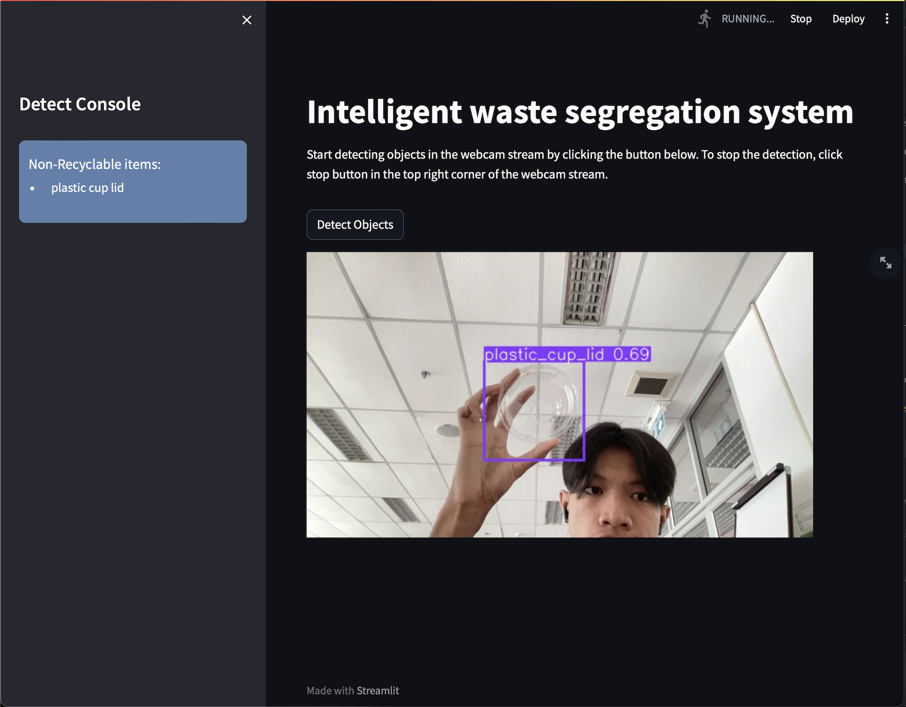

# Intelligent Waste Segregation System

A deep learning-based web application that classifies waste into **Recyclable**, **Non-Recyclable**, or **Hazardous** categories using a YOLOv8 object detection model and deployed with Streamlit.

## Overview

Waste segregation is a vital step in efficient waste management. This project introduces an intelligent system that automates the process of classifying waste using computer vision and object detection techniques.

The application uses a YOLOv8 model trained on real-world waste images to identify different types of waste in a webcam stream. It provides an instant classification to assist in sustainable disposal methods.

This system aims to aid municipalities, environmental organizations, and public users in promoting eco-friendly waste management.

## Demo

Here is a quick look at the Intelligent Waste Segregation System in action:



- Launch the app and activate your webcam.
- The system detects and classifies visible waste items in real-time.
- Waste is categorized as **Recyclable**, **Non-Recyclable**, or **Hazardous**.

> 🔗 *[Live Demo – Try the App](https://intelligent-waste-segregation-system.streamlit.app)*

## Features

- 🗑️ Detects and classifies waste in real-time via webcam
- 🔍 Categories: **Recyclable**, **Non-Recyclable**, **Hazardous**
- 📷 Accepts webcam feed for object detection
- ⚙️ Built using **YOLOv8** for high-speed object detection
- 🌐 Web interface powered by **Streamlit**
- ✅ Simple, interactive, and educational UI

## Tech Stack

- **Python** – Core programming language
- **YOLOv8 (Ultralytics)** – Object detection model
- **OpenCV** – Webcam access and image processing
- **Streamlit** – Web app development
- **Jupyter Notebook / Colab** – Model training and development

## Dataset

The model was trained on a custom dataset provided by Roboflow.

👉 [View Dataset on Roboflow](https://universe.roboflow.com/ai-project-i3wje/waste-detection-vqkjo/model/3)

## Installation Guide

To set up the project on your local machine:

### 1. Clone the Repository

```bash
git clone https://github.com/boss4848/waste-detection.git
cd waste-detection
